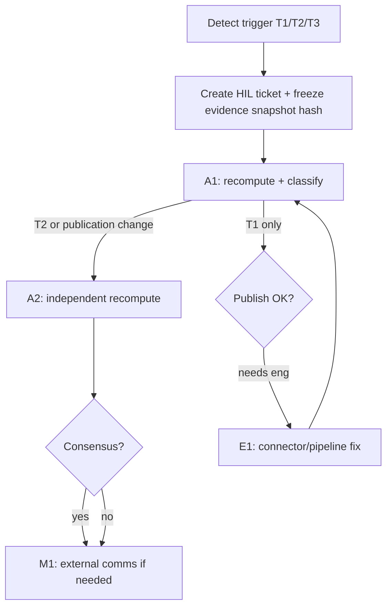

## Human-in-the-loop (HIL) & escalation SOP (audit-ready template)

This SOP defines **mandatory** human review thresholds and escalation paths for operational use of NFSI outputs.

### Trigger thresholds (minimum)

- **T1 — large movement**: if $|\Delta \text{NFSI}_{c,t}| > 6$ within 24h, require human review before external dissemination.
- **T2 — crash mode**: if crash mode triggers ($\min(S) < 25$ for group-100 scores excluding placeholders), require 2-person review within 4h.
- **T3 — data integrity anomaly**: if no-data ratio $\ge 0.5$ OR ingestion errors for any group-100 connector, require review within 8h.

### Roles

- **On-call analyst (A1)**: first review, context check, and incident classification.
- **Second reviewer (A2)**: independent confirmation for T2 and any publication-affecting changes.
- **Engineering on-call (E1)**: investigates connector failures, data integrity anomalies, pipeline regressions.
- **Duty manager (M1)**: decision authority for public corrections and dispute handling.

### RACI (minimum)

| Activity | A1 | A2 | E1 | M1 |
| :--- | :---: | :---: | :---: | :---: |
| Triage + initial classification | **R/A** | I | C | I |
| Independent recompute + sign-off | C | **R/A** | C | I |
| Connector/pipeline remediation | C | C | **R/A** | I |
| Public correction / rollback decision | C | C | C | **A** |

Legend: **R** responsible, **A** accountable, **C** consulted, **I** informed.

### Escalation flow (normative)



### Operational playbooks (linked automated checks)

These are intentionally small, CI-friendly checks that mirror manuscript thresholds:

- **P1 — Crash mode predicate**: `php research/deposit/recompute/run_validation_playbooks.php` (Test A)
- **P2 — High missingness inertia branch**: same script (Test B)
- **P3 — Constant sensitivity toy (Layer‑2 smoothing isolates `LAYER2_TODAY_WEIGHT`)**: same script (Test C)
- **P4 — Population edge cases (`popNegMult`, fragility cap)**: same script (Test D)
- **P5 — Determinism / byte-identical outputs**: `bash research/deposit/validate_recompute.sh` (double recompute + `cmp`)

### Communication templates (external)

#### Template E — Public status note (short)

```text
Update (UTC {timestamp}): We are reviewing an unusual movement in NFSI for {ISO2} on {YYYY-MM-DD}
due to {data anomaly | security signal | pipeline issue}. Published values may be delayed or held
until review completes. We do not infer causality from the index. Evidence references: {manifest hash}.
```

#### Template F — Correction published

```text
Correction (UTC {timestamp}): NFSI values for {ISO2} on {YYYY-MM-DD} were updated after a verified
{connector outage | ingestion defect | methodology fix}. Previous value: {old}. Updated value: {new}.
Pinned code commit: {sha}. Evidence bundle: {path + hash}.
```

### SLA targets

- **T1**: A1 review completed within **12h**; E1 engaged if connector issue suspected.
- **T2**: A1 + A2 review completed within **4h**; M1 informed immediately.
- **T3**: A1 triage within **8h**; E1 engaged within **2h** of confirmation.

### Evidence requirements (per incident)

- timestamp (UTC), country iso2, date_ymd
- triggering rule and threshold value
- relevant connector IDs and ingestion status
- git commit hash and evidence manifest hash
- link to audit-log partition / digest

### Templates (copy/paste)

#### Template A — HIL Review Ticket (T1/T2/T3)

```text
Title: [NFSI HIL] {T1|T2|T3} {ISO2} {YYYY-MM-DD} — {short reason}

Context
- UTC timestamp created:
- Country: ISO2=
- Date: YYYY-MM-DD
- Trigger: {T1|T2|T3}
- Threshold value(s): (e.g. |Δ|=…, minSec=…, no_data_share=…)

System provenance
- Code commit:
- Deposit run manifest (path + hash):
- Recompute command (exact CLI):

Data provenance
- Connector IDs involved:
- Ingestion status (OK / delayed / missing / error):
- Source snapshot date/version (if pinned):

Reviewer actions (A1)
- [ ] Verify trigger computation (recompute + invariant checks)
- [ ] Check connector outages / missingness anomalies
- [ ] Check news context (2 sources minimum; URLs recorded)
- [ ] Classify incident: {data outage | real-world event | model artifact | unknown}

Second review (A2; required for T2 and publication changes)
- [ ] Independently rerun recompute
- [ ] Confirm classification and recommended action

Decision (M1 if needed)
- Action: {publish unchanged | publish with note | hold publication | correction | rollback}
- External note text (if any):

Evidence bundle attached
- [ ] `evidence_bundle.zip` (see Template B)
```

#### Template B — Evidence Bundle manifest (`evidence_bundle/MANIFEST.json`)

```text
{
  "created_utc": "YYYY-MM-DDTHH:MM:SSZ",
  "iso2": "XX",
  "date_ymd": "YYYY-MM-DD",
  "trigger": "T2",
  "code_commit": "…",
  "recompute": {
    "command": "php research/deposit/recompute/recompute_nfsi_fixture.php --fixture-dir=… --out=…",
    "outputs": [
      {"path": "nfsi_out.csv", "sha256": "…"}
    ]
  },
  "inputs": [
    {"path": "connector_meta.csv.txt", "sha256": "…"},
    {"path": "country_meta.csv.txt", "sha256": "…"},
    {"path": "connectors_raw.csv.txt", "sha256": "…"}
  ],
  "audit_checks": [
    {"name": "check_invariants_fixture.php", "result": "PASS", "log_path": "logs/invariants.log"}
  ],
  "review": {
    "analyst_a1": {"name": "…", "timestamp_utc": "…", "summary": "…"},
    "analyst_a2": {"name": "…", "timestamp_utc": "…", "summary": "…"}
  }
}
```

#### Template C — Reviewer Checklist (minimal)

```text
Recompute / invariants
- [ ] Deterministic recompute run produced expected outputs for pinned inputs
- [ ] Invariants PASS (bounds, crash override, daily cap, determinism)

Crash mode (if applicable)
- [ ] minSec computed from real group-100 (no placeholders)
- [ ] crash predicate minSec < 25 verified
- [ ] inertia bypass verified (nfsi_today == nfsi_raw)

Missingness
- [ ] no_data_share computed; if >=0.5, weight selection verified
- [ ] connector outages documented with timestamps

Publication decision
- [ ] External messaging drafted (plain language; no causality claims)
- [ ] Evidence bundle stored and referenced
```

#### Template D — Example (filled, synthetic)

```text
Title: [NFSI HIL] T2 GG 2026-01-03 — crash mode triggered

Context
- UTC timestamp created: 2026-05-05T13:30:00Z
- Country: ISO2=GG
- Date: 2026-01-03
- Trigger: T2
- Threshold value(s): minSec=11.72 (<25)

System provenance
- Code commit: <pinned commit hash>
- Deposit run manifest: research/deposit/backtest/run_manifest.json
- Recompute command: php research/deposit/recompute/recompute_nfsi_fixture.php --fixture-dir=research/deposit/sample-dataset --out=/tmp/nfsi_out.csv

Data provenance
- Connector IDs involved: SEC_CONFLICT
- Ingestion status: OK

Reviewer actions (A1)
- Verified crash predicate and inertia bypass; nfsi_today == l3_score == 1.00
- Classified as: real-world event (synthetic example)

Second review (A2)
- Confirmed recompute output matches expected fixture output hash

Decision
- Action: publish with note (crash-mode reaction)
```

### Public dispute pathway

- A public dispute/correction page SHOULD exist and MUST document:
  - date/time of correction,
  - impacted countries/days,
  - reason category (data error, connector outage, methodology revision),
  - code version/commit reference,
  - whether values were recomputed.

